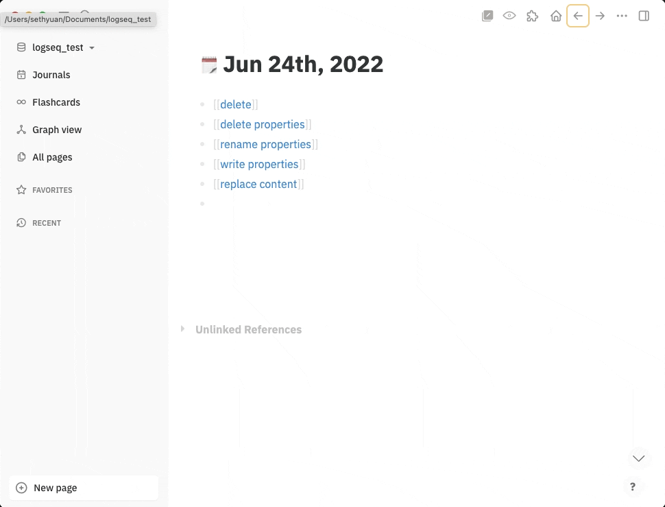
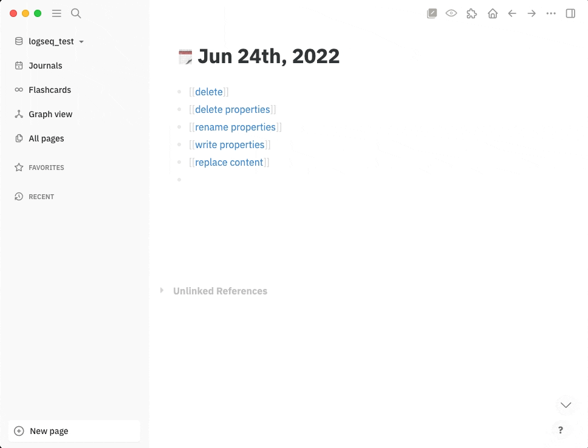

[中文](README.md) | English

# logseq-plugin-batch-op

Perform queries on the current graph and batch process on the results.

## Usage

### Batch Delete

### Batch Delete Properties

### Batch Rename Properties

### Batch Replace/Write Properties

### Batch Replace Content

### Perform batch processing only on selected results

## Translations

You can submit a PR with the translation files to the [project](https://github.com/sethyuan/logseq-plugin-batch-op/tree/master/src/translations), please refer to the `zh-CN.json` file in the project as an example.
